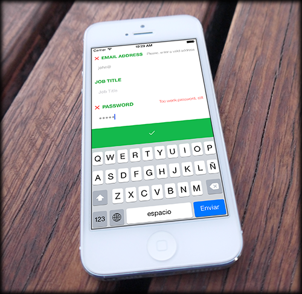

# NewAge
This is a demo theme supporting only [SignUpScreenlet](https://github.com/liferay/liferay-screens/blob/master/ios/Documentation/SignUpScreenlet.md)

It includes the following features:

- New flat white/green UI
- Ready to be used at fullscreen.
- Adaptative layout: supported both vertical and horizontal orientations. Several resolutions (not tested).
- Layout adapted for keyboard: submit button is always visible. Scroll on fields.
- Fields validation: required fields, valid email, etc.
- Shake button effect when form is not valid.
- Password strength algorithm: shows if your password is weak, valid or strong.
- Localized to English, Spanish, German and Chinese (traditional)

